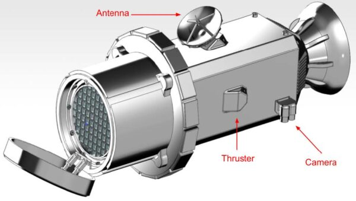

# Mission to Psyche
A simulation for sampling and M-type asteroid

## Description of Project
The aim of this project is to create a web based tool that allows users to learn and 
experiment with simulations for sampling a metal asteroid in the NASA Psyche mission. 
This product aims to help users understand the possible solutions for sampling a 
metal-based (M-type) asteroid by allowing them to interact with a virtual environment. 
The system will integrate real-world data that contains examples of those samples. 
NASA’s Psyche mission aims to create an engaging and accessible platform for the 
scientific community and for the public to simulate M-type asteroid sampling and 
analysis without the need to download software.  NASA Psyche wants to address the lack 
of easily accessible tools that allow for public and more professional communities to 
interact with and simulate sampling scenarios. The key challenge here is to develop a 
browser based tool that creates an intuitive application for public consumption, 
allowing users to visualize, learn and interact with asteroid sampling in a meaningful 
way. The project will be built using web based frameworks, such as VUE and Unity, and 
hosted on Firebase for easy access.

## Sampling Tools
### Archimede's Screw: [See the full design](https://psyche.asu.edu/get-involved/capstone-projects/capstone-projects-tungsten-class/sample-acquisition-archimedes-screw-for-sample-collection-asu/)
Engineers and Designers: Michael Weiss, Jose Iturralde, Derek Welch, Elaina Ashton, Erin Steele

While a tool with roots from [ancient Egypt](https://en.wikipedia.org/wiki/Archimedes%27_screw) may seem like an unlikely gadget for modern space exploration, its timeless design could prove useful on the 16 Psyche asteroid. Desinged by a team of mechanical and electical engineers at Arizona State University [(See here)](https://psyche.asu.edu/get-involved/capstone-projects/capstone-projects-tungsten-class/sample-acquisition-archimedes-screw-for-sample-collection-asu/), this iteration of the Archimede's Screw touts a productive suite of features including an encased screw for retaining samples, potential for a rotating container system with sensors to verify when they are full, and a DC motor to provide motion. The tool has also been tested to work in micro gravity environments.  

### Claw and Filtration Funnel: [See the full design](https://psyche.asu.edu/get-involved/capstone-projects/capstone-projects-tungsten-class/isru-claw-and-filtration-funnel-rit/)
Engineers and Designers: Alex Nestor, Anthony Smith, Eliya Fischev, Madeleine Goulet, Max Wolbeck, William Z. Tom

###  Touch-and-Go: [See the full design](https://psyche.asu.edu/get-involved/capstone-projects/capstone-projects-tungsten-class/sample-return-nasa-psyche-sample-return-osu/)
Engineers and Designers: Abdullah Azmat, Laurel Bright Berman, Portia Council, Leanne Fischer, Chenghao Li, and Steven Nguyen
[]
"Touch-and-Go" was inspired by [NASA's Stardust mission](https://science.nasa.gov/mission/stardust/) as well as their [OSIRIS-REx TAGSAM](https://www.nasa.gov/news-release/nasas-osiris-rex-spacecraft-successfully-touches-asteroid/) (Touch-and-Go Sample Acquisition Mechanism). The design was meant to reduce costs and the complexity of sampling Psyche. Specifically, the team that designed it stated that it elimates the need for "a lander, a rover, and returning propulsion". The Touch-and-Go design has 3 phases: impact, collect, and return. The front of the drone contains a "collection disk" made of Aerogel that is double-sided to accomodate samples of different sizes. Appropriate stress tests were simulated and passed in order to confirm the drone's ability to withstand the impact and collecting phases of the mission.

### Chimra [See internal structure](https://science.nasa.gov/resource/internal-chambers-of-chimra/)
Developed for the Curiosity rover, the Chimra scoops up regolish, sieves, and transports rocks to be collected and analyzed by internal components.

### Authors and Engineers
* Daryl Kyle
* Eric Romero
* Maddison Ives
* Mitchell Doran
* Tristan Crawford
