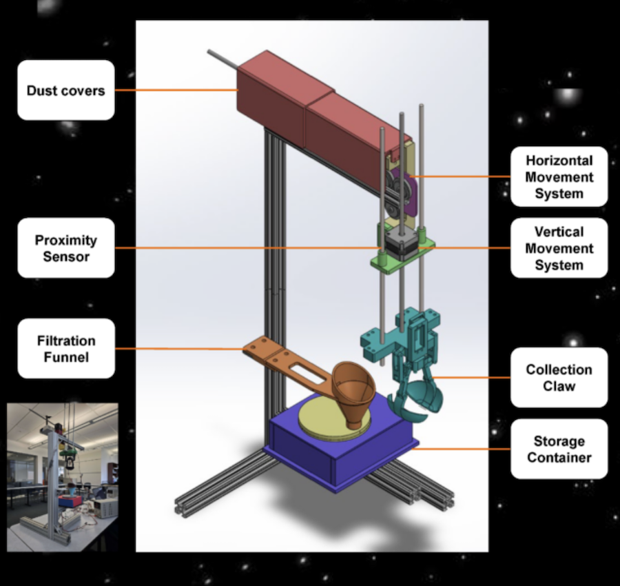

# Mission to Psyche
A simulation for sampling an M-type asteroid

## Description of Project
Developed in the Unity game engine, this simulation was designed and implemented by a team of five software engineering students from Arizona State University. It presents a visionary concept for the future of surface exploration on 16 Psyche—a potentially metal-rich asteroid located between Mars and Jupiter. Created in collaboration with researchers from the current NASA Psyche mission, the simulation explores theoretical sampling techniques that may one day be used in asteroid surface exploration.

The environment features five distinct theoretical zones, each modeled to represent a variety of topographical terrains: the floor of a crater, the ridge of an impact zone, the edge of a rift, a broad plain, and a highlands region. Within each zone, the mission objective is to collect four unique samples for eventual laboratory analysis.

To achieve this, the rover is equipped with a combination of legacy and conceptual sampling tools. The Claw, a simple hinged bucket, is used to capture surface material. 

The Archimedes’ Screw, originally a water transport device and redesigned by previous ASU mechanical engineering students, operates by rotating perpendicular to the surface to lift regolith into a collection container.

The Touch-and-Go mechanism, also prototyped by ASU mechanical engineering students, is inspired by the OSIRIS-REx mission. This futuristic tool targets a sampling site, impacts the terrain with controlled force, and captures ejected particles using an automated collection system before ascending.

Finally, the CHIMRA (Collection and Handling for In-situ Martian Rock Analysis) tool, adapted from NASA’s Curiosity rover, is employed to scoop, sieve, and transport samples for analysis within the rover’s internal laboratory.

This simulation serves not only as an educational platform but also as a speculative exploration of how future missions might approach extraterrestrial material sampling on metallic asteroids.

## Sampling Tools
### Archimede's Screw: [See the full design](https://psyche.asu.edu/get-involved/capstone-projects/capstone-projects-tungsten-class/sample-acquisition-archimedes-screw-for-sample-collection-asu/)
Engineers and Designers: Michael Weiss, Jose Iturralde, Derek Welch, Elaina Ashton, Erin Steele

While a tool with roots from [ancient Egypt](https://en.wikipedia.org/wiki/Archimedes%27_screw) may seem like an unlikely gadget for modern space exploration, its timeless design could prove useful on the 16 Psyche asteroid. Desinged by a team of mechanical and electical engineers at Arizona State University [(See here)](https://psyche.asu.edu/get-involved/capstone-projects/capstone-projects-tungsten-class/sample-acquisition-archimedes-screw-for-sample-collection-asu/), this iteration of the Archimede's Screw touts a productive suite of features including an encased screw for retaining samples, potential for a rotating container system with sensors to verify when they are full, and a DC motor to provide motion. The tool has also been tested to work in micro gravity environments.
***

### Claw and Filtration Funnel: [See the full design](https://psyche.asu.edu/get-involved/capstone-projects/capstone-projects-tungsten-class/isru-claw-and-filtration-funnel-rit/)
Engineers and Designers: Alex Nestor, Anthony Smith, Eliya Fischev, Madeleine Goulet, Max Wolbeck, William Z. Tom

***

###  Touch-and-Go: [See the full design](https://psyche.asu.edu/get-involved/capstone-projects/capstone-projects-tungsten-class/sample-return-nasa-psyche-sample-return-osu/)
Engineers and Designers: Abdullah Azmat, Laurel Bright Berman, Portia Council, Leanne Fischer, Chenghao Li, and Steven Nguyen
 
"Touch-and-Go" was inspired by [NASA's Stardust mission](https://science.nasa.gov/mission/stardust/) as well as their [OSIRIS-REx TAGSAM](https://www.nasa.gov/news-release/nasas-osiris-rex-spacecraft-successfully-touches-asteroid/) (Touch-and-Go Sample Acquisition Mechanism). The design was meant to reduce costs and the complexity of sampling Psyche. Specifically, the team that designed it stated that it elimates the need for "a lander, a rover, and returning propulsion". The Touch-and-Go design has 3 phases: impact, collect, and return. The front of the drone contains a "collection disk" made of Aerogel that is double-sided to accomodate samples of different sizes. Appropriate stress tests were simulated and passed in order to confirm the drone's ability to withstand the impact and collecting phases of the mission.
***

### Chimra [See the full design](https://science.nasa.gov/resource/internal-chambers-of-chimra/)

Developed by NASA's Jet Propulsion Laboratory

Developed for the Curiosity rover, the Chimra scoops up regolith, sieves, and transports rocks to be collected and analyzed by internal components.
***

## Hypothetical Terrains on 16 Psyche

### Crater Ridge Zone

***

### The Highlands Zone

***

### Edge of Crater Zone

***

### The Flats Zone

***

### Inner Crater Zone

## Authors and Engineers
* Daryl Kyle
* Eric Romero
* Maddison Ives
* Mitchell Doran
* Tristan Crawford
